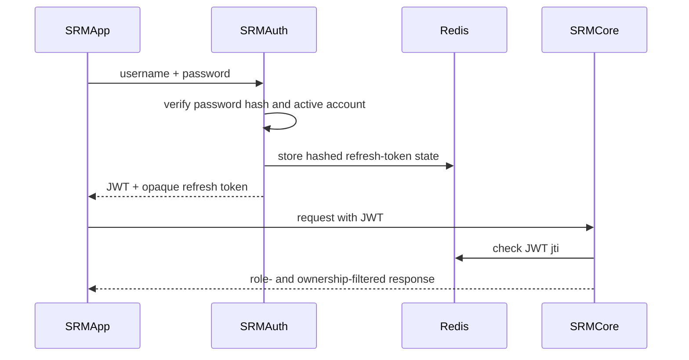
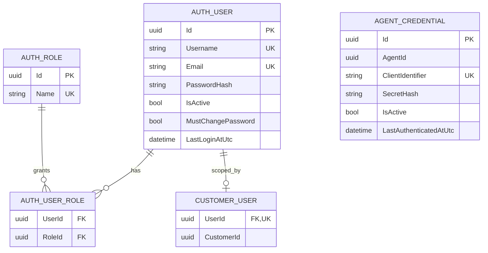

# Authentication and Authorization Concept

## Purpose and authority

This document defines the implemented security model. The project requirement that customers can see only their own data and cannot change monitoring configuration is authoritative.

## Service responsibilities

- `SRMAuth` authenticates human users and Agent identities, manages identity data, issues JWTs, rotates refresh tokens, and records revocation.
- `SRMCore` validates JWTs, checks revocation, enforces endpoint roles, and applies customer ownership filters in the service layer.
- `SRMApp` keeps the browser session in protected server-side storage and forwards bearer tokens.
- `SRMAgent` exchanges its client identifier and secret for an Agent JWT and calls only dedicated Agent endpoints.

## Persistence split

| Store | Owner | Data |
|---|---|---|
| Auth SQL database | `SRMAuth` | users, roles, user-role assignments, customer ID assignments, Agent credentials |
| Core SQL database | `SRMCore` | customers, rooms, devices, telemetry, incidents, ticket links |
| Redis | Auth/Core | hashed refresh-token state and revoked access-token JTIs |

`CustomerUser.CustomerId` and `AgentCredential.AgentId` are external identifiers owned by Core. Auth deliberately does not duplicate Core's customer or Agent tables. Cross-service reference validation remains an open provisioning concern.

## Principals and role matrix

| Capability | SystemAdmin | Employee | CustomerAdmin | Customer | Agent |
|---|---:|---:|---:|---:|---:|
| View all monitoring data | Yes | Yes | No | No | No |
| View own customer monitoring data | Yes | Yes | Yes | Yes | No |
| Manage customers and monitoring configuration | Yes | Yes | No | No | No |
| Manage all customer users | Yes | Customer roles only | No | No | No |
| Manage users of own customer | Yes | Yes | Yes | No | No |
| Manage Agent credentials | Yes | Yes | No | No | No |
| Manage own profile/password | Yes | Yes | Yes | Yes | No |
| Fetch own Agent configuration | No | No | No | No | Yes |
| Submit telemetry for assigned devices | No | No | No | No | Yes |

Customer-scoped JWTs contain exactly one `customer_id`. Internal and customer-scoped roles cannot be combined. Human-user administration rejects unknown roles and the machine-only `Agent` role.

Core permits human roles on read endpoints. Monitoring mutations require `SystemAdmin` or `Employee`; ownership filters remain active for each customer read. Agent telemetry is accepted only through dedicated endpoints and only for devices assigned to the authenticated `agent_id`.

## Token model

### Access token

- signed JWT using HMAC SHA-256
- configured issuer, audience, key, and lifetime
- one-minute validation clock skew
- unique `jti` checked against Redis by Auth and Core
- human claims: subject/user ID, username, roles, optional `customer_id`
- Agent claims: credential subject, `Agent` role, `agent_id`, and `agent.api` scope

### Refresh token

- opaque 256-bit random value returned only to the human client
- only its SHA-256 hash is stored in Redis
- expiration and revocation state have Redis TTLs
- rotated on each successful refresh
- Agent identities do not receive refresh tokens

### Logout

Logout revokes the supplied refresh token and records the current access-token JTI in Redis until its original expiry. Protected services reject a revoked JTI.

## Authentication flow

## Auth SQL model

## Implemented safeguards

- ASP.NET Core `PasswordHasher` and a 12-character complexity policy
- unique usernames, emails, role names, client identifiers, and one customer assignment per user
- forced password change after administrative reset
- backend role and ownership checks independent of UI visibility
- separate human and Agent login endpoints
- secrets supplied through ignored environment files or deployment secrets

## Remaining security work

Audit logging, atomic refresh rotation, cross-service reference provisioning, Agent webhook authentication, dependency readiness, and broader HTTP/end-to-end tests remain open in [TODO.md](TODO.md).
