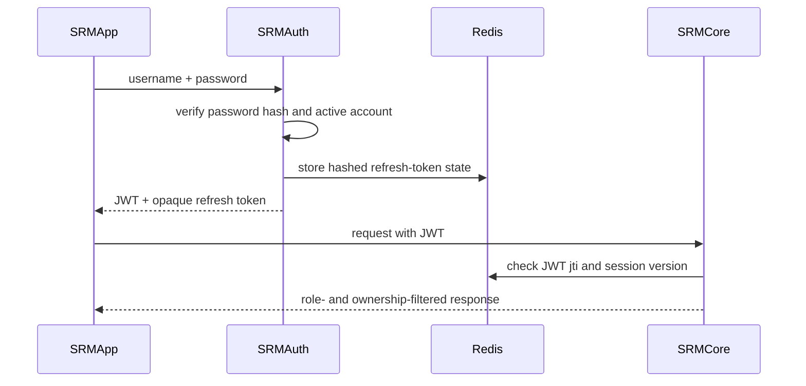
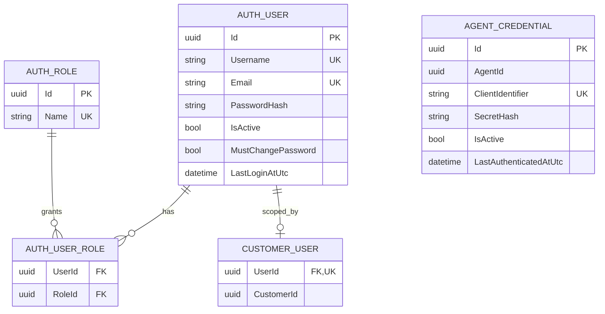

# Authentication and Authorization Concept

## Purpose and authority

This document defines the implemented security model. The project requirement that customers can see only their own data and cannot change monitoring configuration is authoritative.

## Service responsibilities

- `SRMAuth` authenticates human users and Agent identities, rate-limits failed logins, manages identity data, issues JWTs, rotates refresh tokens, revokes principal sessions, and records security audits.
- `SRMCore` validates JWTs, checks token and principal-session revocation, enforces endpoint roles, applies customer ownership filters in the service layer, and records monitoring-configuration audits.
- `SRMApp` keeps the browser session in encrypted protected browser storage, synchronizes login/logout changes across tabs, and forwards bearer tokens.
- `SRMAgent` exchanges its client identifier and secret for an Agent JWT and calls only dedicated Agent endpoints.

## Persistence split

| Store | Owner | Data |
|---|---|---|
| Auth SQL database | `SRMAuth` | users, roles, user-role assignments, customer ID assignments, Agent credentials, identity security audits |
| Core SQL database | `SRMCore` | customers, rooms, devices, telemetry, incidents, ticket links, configuration security audits |
| Redis | Auth/Core/App | hashed refresh-token state, revoked access-token JTIs, principal session versions, and failed-login counters |

`CustomerUser.CustomerId` and `AgentCredential.AgentId` are external identifiers owned by Core. Auth deliberately does not duplicate Core's customer or Agent tables. Cross-service reference validation remains an open provisioning concern.

## Principals and role matrix

| Capability | SystemAdmin | Employee | CustomerAdmin | Customer | Agent |
|---|---:|---:|---:|---:|---:|
| View all monitoring data | Yes | Yes | No | No | No |
| View own customer monitoring data | Yes | Yes | Yes | Yes | No |
| Manage customers and monitoring configuration | Yes | Yes | No | No | No |
| Manage all customer users | Yes | Customer roles only | No | No | No |
| Manage users of own customer | Yes | Yes | Yes | No | No |
| Manage Agent credentials | Yes | Yes | No | No | No |
| Manage own profile/password | Yes | Yes | Yes | Yes | No |
| Fetch own Agent configuration | No | No | No | No | Yes |
| Submit telemetry for assigned devices | No | No | No | No | Yes |

Customer-scoped JWTs contain exactly one `customer_id`. Internal and customer-scoped roles cannot be combined. Human-user administration rejects unknown roles and the machine-only `Agent` role.

Core permits human roles on read endpoints. Monitoring mutations require `SystemAdmin` or `Employee`; ownership filters remain active for each customer read. Agent telemetry is accepted only through dedicated endpoints and only for devices assigned to the authenticated `agent_id`.

## Token model

### Access token

- signed JWT using HMAC SHA-256
- configured issuer, audience, key, and lifetime
- one-minute validation clock skew
- unique `jti` checked against Redis by Auth and Core
- a principal `session_version` checked against Redis by Auth and Core
- human claims: subject/user ID, username, roles, optional `customer_id`, and forced-password-change state
- Agent claims: credential subject, `Agent` role, `agent_id`, `agent.api` scope, and session version
- startup validation rejects a missing issuer/audience or a signing key shorter than 32 characters

### Refresh token

- opaque 256-bit random value returned only to the human client
- only its SHA-256 hash is stored in Redis
- expiration and revocation state have Redis TTLs
- rotated atomically on each successful refresh; concurrent reuse can create only one successor token
- bound to the current user session version, so a globally revoked session cannot be refreshed
- Agent identities do not receive refresh tokens

### Logout

Logout revokes the supplied refresh token and records the current access-token JTI in Redis until its original expiry. Protected services reject a revoked JTI.

Removing the protected browser session emits a browser storage event to other open SRM tabs. Each tab immediately clears its in-memory identity and returns to the login page. As a fallback, a `401 Unauthorized` response from Core or a protected Auth request also clears the persisted session and broadcasts the same change.

Password changes, administrative password resets, user security changes, and Agent credential changes rotate the affected principal's session version. All previously issued access and refresh tokens for that principal then fail validation. A user must sign in again after changing their password.

## Login protection

Human and Agent logins use Redis-backed counters keyed by a hash of the normalized identifier and principal type. Five failures within the default 15-minute window return HTTP `429 Too Many Requests` with `Retry-After`; a successful login clears the counter. Unknown and existing identifiers use the same externally visible failure behavior.

Accounts marked `MustChangePassword` receive a corresponding JWT claim. Server-side middleware permits only profile read, logout, and password change until the password is changed; UI visibility is not the enforcement boundary.

## Authentication flow

## Auth SQL model

## Implemented safeguards

- ASP.NET Core `PasswordHasher` and a 12-character complexity policy
- unique usernames, emails, role names, client identifiers, and one customer assignment per user
- forced password change after administrative reset
- API-level restriction while a forced password change is pending
- Redis-backed human and Agent login throttling
- atomic, single-use refresh-token rotation
- global principal-session revocation after security-sensitive identity or credential changes
- password-authenticated Redis in local and Azure deployments
- append-only audit records for authentication outcomes, password and credential administration, user administration, and monitoring-configuration changes
- backend role and ownership checks independent of UI visibility
- separate human and Agent login endpoints
- secrets supplied through ignored environment files or deployment secrets

## Security audit records

Security events are stored in the owning SQL database with UTC timestamp, event type, outcome, actor, source address, target, optional customer scope, and a bounded description. Passwords, Agent secrets, access tokens, and refresh tokens are never written to these records. Audit records are currently database-only and have no UI/API administration surface.

## Remaining security work

Cross-service reference provisioning, Agent webhook authentication, dependency readiness, retention rules, and broader HTTP/end-to-end tests remain open in [TODO.md](TODO.md).
