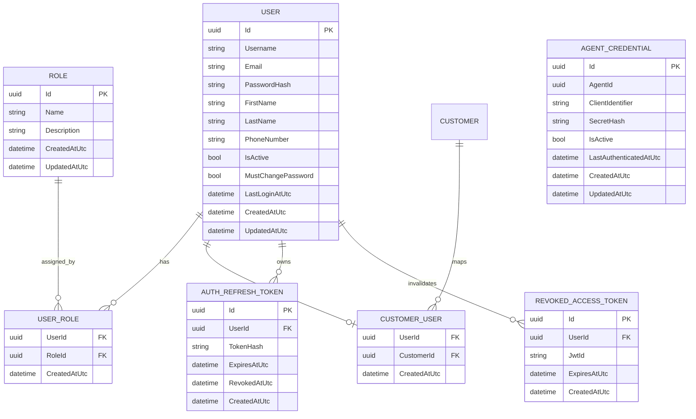

# Authentication and Authorization Concept

## Purpose

This document defines the current authentication and authorization architecture for the Server Room Monitoring project and records the remaining target-state gaps.

It covers:

- auth service responsibilities
- principal types
- authorization matrix
- token model
- auth data model
- service interaction flow
- remaining implementation TODOs

## Current State on July 18, 2026

The current implementation is:

- `SRMAuth` uses a SQL database for users and machine credentials, and Redis for refresh tokens and revoked access-token JTIs
- `SRMCore` validates JWT access tokens issued by `SRMAuth`
- `SRMApp` authenticates human users and calls `SRMCore` on their behalf with forwarded bearer tokens
- `SRMAgent` authenticates as a machine principal and calls dedicated agent endpoints

This now matches the required target architecture from the project specification: SQL Server stores identity data, and Redis stores short-lived token state.

## Target Architecture

The intended target architecture is:

- SQL Server in `SRMAuth` for identity data
- Redis in `SRMAuth` for refresh tokens
- Redis in `SRMAuth` for access-token revocation state

That means the long-term responsibility split should be:

- SQL Server:
  - users
  - roles
  - user-role assignments
  - customer-user assignments
  - agent credentials
- Redis:
  - refresh tokens
  - refresh-token rotation state
  - revoked access-token JTIs
  - other short-lived auth session state if needed later

The main target-state items that are still not implemented are:

- Redis-backed token storage for refresh tokens and access-token revocation
- broader policy-based authorization refinement beyond the current role and ownership model
- additional auth and authorization integration coverage
- environment-based secret management for non-local deployment

## Principal Types

### `SystemAdmin`

Platform-wide administrator with unrestricted access to all customers, users, and technical resources.

### `Employee`

Internal company user with operational access across all customers. This role manages monitoring configuration and monitoring data across the platform, but it is not a platform administrator.

### `CustomerAdmin`

Customer-scoped administrator. This role manages users of exactly one customer and can also perform all actions that a normal customer can perform for that same customer.

### `Customer`

Customer-scoped business and technical user. This role manages monitoring data and configuration only for its own customer. It may later also acknowledge alerts and create maintenance windows in a more guided workflow.

### `Agent`

Machine identity used by the on-site appliance or virtual agent. This principal is not a human account and receives tightly scoped API permissions for telemetry and configuration exchange.

## Role Matrix

| Capability | SystemAdmin | Employee | CustomerAdmin | Customer | Agent |
|---|---|---|---|---|---|
| View all customers | Yes | Yes | No | No | No |
| View own customer | Yes | Yes | Yes | Yes | No |
| Manage customers | Yes | Yes | No | No | No |
| Manage server rooms | Yes | Yes | Own customer | Own customer | No |
| Manage agents | Yes | Yes | Own customer | Own customer | No |
| Manage Shelly devices | Yes | Yes | Own customer | Own customer | No |
| Manage monitored devices | Yes | Yes | Own customer | Own customer | No |
| Manage monitored-device ping results | Yes | Yes | Own customer | Own customer | Submit only through dedicated endpoints |
| Manage maintenance windows | Yes | Yes | Own customer | Own customer | No |
| Manage sensor readings | Yes | Yes | Own customer | Own customer | Submit only through dedicated endpoints |
| Manage users of own customer | Yes | No | Yes | No | No |
| Manage users of other customers | Yes | Yes | No | No | No |
| Manage own user profile | Yes | Yes | Yes | Yes | No |
| Fetch own agent configuration | No | No | No | No | Yes |
| Submit telemetry and ping results | No | No | No | No | Yes |

## Authorization Principles

- Authentication determines who the caller is.
- Authorization determines what the caller may do.
- `SRMCore` must enforce both endpoint access and data ownership.
- Customer-scoped UI restrictions are not sufficient. Backend authorization must remain authoritative.
- Agents must use dedicated agent endpoints and must not call generic CRUD endpoints.

## Token Model

### Current Access Token

- format: JWT
- lifetime: currently configured in `SRMAuth`
- intended use: API authorization for `SRMCore`
- signed by: `SRMAuth`

### Current Refresh Token

- format: opaque random token
- lifetime: currently configured in `SRMAuth`
- intended use: session continuation for human users in `SRMApp`
- persistence: SQL database in `SRMAuth`
- rotation: yes
- revocation: yes

### Target Refresh Token Storage

- format: opaque random token
- intended persistence: Redis
- intended lifecycle: short-lived, rotated, and revocable

### Target Access-Token Revocation Storage

- intended persistence: Redis
- key content: JWT JTI plus expiry
- intended lifecycle: retained only until the original token expiry time

### Suggested JWT Claims

Common claims:

- `sub`
- `jti`
- `iss`
- `aud`
- `iat`
- `nbf`
- `exp`
- `role`

Human user claims:

- `username`
- `customer_id` for `CustomerAdmin` and `Customer`

Agent claims:

- `agent_id`
- `scope`

## Token Flows

### Human User Login Flow

1. A user logs in through `SRMApp`.
2. `SRMApp` sends credentials to `SRMAuth`.
3. `SRMAuth` validates the password hash from its SQL database.
4. `SRMAuth` issues a short-lived JWT access token and a refresh token.
5. `SRMApp` stores the current authenticated state in its server-side session service.
6. `SRMApp` calls `SRMCore` with the access token.
7. If the access token is near expiry, `SRMApp` requests a rotated token pair from `SRMAuth`.

### Human User Logout Flow

1. A user triggers logout in `SRMApp`.
2. `SRMApp` sends the current refresh token to `SRMAuth`.
3. `SRMAuth` revokes the refresh token.
4. `SRMAuth` records the current access-token JTI as revoked until the token expiry time.
5. `SRMApp` clears the local authenticated session.

### Agent Login Flow

1. `SRMAgent` authenticates against `SRMAuth` with machine credentials.
2. `SRMAuth` validates the `AgentCredential` record.
3. `SRMAuth` issues an access token with `role=Agent` and the related `agent_id`.
4. `SRMAgent` uses that token only for dedicated `SRMCore` agent endpoints.

## Service Responsibilities

### `SRMAuth`

- issue JWT access tokens
- hash and verify passwords
- manage user accounts and role assignments
- manage machine credentials for agents

Current endpoint responsibilities:

- `POST /api/auth/login`
- `POST /api/auth/refresh`
- `POST /api/auth/logout`
- `POST /api/auth/agent/login`
- `GET /api/auth/me`
- `PUT /api/auth/me`
- `POST /api/auth/change-password`
- user administration endpoints for `SystemAdmin`, `Employee`, and `CustomerAdmin`
- agent credential administration endpoints for `SystemAdmin` and `Employee`

### `SRMCore`

- validate JWT bearer tokens
- authorize requests through roles and endpoint restrictions
- expose dedicated ingestion and configuration endpoints for agents

Current protected agent endpoint groups:

- `GET /api/agent-runtime/configuration`
- `POST /api/agent-reporting/sensor-readings`
- `POST /api/agent-reporting/ping-results`

### `SRMApp`

- authenticate human users against `SRMAuth`
- maintain the current authenticated browser state through a scoped server-side auth session
- call `SRMCore` on behalf of the authenticated user
- expose profile management UI for password and contact changes

### `SRMAgent`

- authenticate as a machine principal against `SRMAuth`
- store its token securely in memory and runtime configuration only
- call only the dedicated agent endpoints in `SRMCore`

## Auth Data Model

### Current SQL Database in `SRMAuth`

The current SQL database holds both identity data and token-state data.

Role definitions are represented in code through an enum-backed role model and are seeded into the `Roles` table during startup. This keeps role usage type-safe in code while still preserving roles as database records for authorization and administration workflows.

`AgentCredential.AgentId` is an external reference to the authoritative agent record in `SRMCore` and is intentionally not enforced as a foreign key inside the auth database.

### Target Persistence Split in `SRMAuth`

The intended final persistence split is:

- SQL Server for durable identity records
- Redis for short-lived token state

When that change is implemented, `AUTH_REFRESH_TOKEN` and `REVOKED_ACCESS_TOKEN` should no longer be persisted in the SQL auth database.

## Security Requirements

- no secrets in source code
- password hashing with a strong one-way algorithm such as ASP.NET Core `PasswordHasher`
- signed JWTs with managed signing key material
- TLS for all inter-service communication
- strict separation between human principals and machine principals
- access-token revocation checks in every protected service
- auditability for login, password change, and user administration events

## Remaining Implementation Plan

### Next Auth Steps

- move refresh tokens and access-token revocation state from SQL Server to Redis
- extend policy-based authorization where the current role model is still coarse
- extend auth and authorization integration tests
- move non-local secrets fully out of tracked configuration

## Remaining Implementation TODOs

- Migrate refresh-token storage from SQL Server to Redis.
- Migrate revoked access-token JTI storage from SQL Server to Redis.
- Update startup and configuration so `SRMAuth` requires a Redis connection for token-state handling.
- Add dedicated end-to-end tests that exercise refresh-token rotation and logout revocation against a real Redis instance.
- Add broader policy-based authorization in `SRMCore`.
- Add unit and integration tests for auth and authorization behavior.

