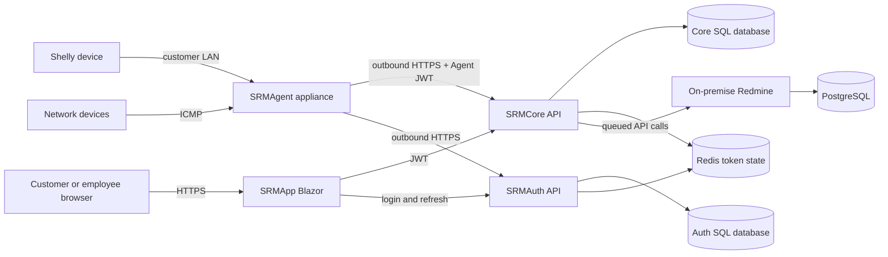

# Server Room Monitoring (SRM)

SRM monitors customer server rooms through an on-site Agent and visualizes the results in a centrally hosted Blazor application. The Agent polls Shelly devices, checks configured network targets by ICMP ping, and sends observations to the Core API. Core owns business data, incident evaluation, maintenance-window handling, and queued Redmine ticket creation. Auth manages human and Agent identities and stores short-lived token state in Redis.

## Project status

The main end-to-end architecture is implemented. The project is not feature-complete; the remaining verified gaps are listed in [TODO.md](TODO.md).

| Area | Status |
|---|---|
| Customer, room, Agent, Shelly, and ping-target configuration | Implemented |
| Customer data isolation and read-only customer access | Implemented |
| Agent authentication and outbound Core communication | Implemented |
| Temperature and door monitoring | Implemented |
| Per-device ping interval, timeout, and failure threshold | Implemented |
| SQL Server business/identity persistence | Implemented |
| Redis refresh-token and access-token revocation state | Implemented |
| Incident correlation and maintenance-window suppression | Implemented |
| Queued Redmine creation, comments, and retry | Implemented |
| Blazor administration and monitoring UI | Implemented |
| Brightness/battery alert rules | Not implemented (optional) |
| Database migrations | Not implemented |
| Full Redmine/Redis end-to-end test automation | Not implemented |

## Architecture



The Agent initiates all central communication, so Core does not require an inbound connection through the customer firewall.

## Roles

- `SystemAdmin`: full platform and user administration.
- `Employee`: cross-customer monitoring configuration and customer-user administration.
- `CustomerAdmin`: read-only monitoring access for one customer plus management of that customer's users.
- `Customer`: read-only monitoring access for one customer.
- `Agent`: machine identity limited to its own runtime configuration and telemetry submission.

See [AUTHENTICATION_AUTHORIZATION_CONCEPT.md](AUTHENTICATION_AUTHORIZATION_CONCEPT.md) for the authoritative role matrix.

## Local setup

Requirements: .NET 10 SDK, Docker Desktop with Linux containers, and PowerShell.

For infrastructure plus locally launched .NET projects:

```powershell
Copy-Item ContainerServices/.env.development.example ContainerServices/.env.development
# Replace every placeholder in the ignored file.
./ContainerServices/Deployment-Local.ps1 -Mode Simulators
dotnet run --project SRMAuth --launch-profile http
dotnet run --project SRMCore --launch-profile http
dotnet run --project SRMApp --launch-profile http
dotnet run --project SRMAgent --launch-profile http
```

For the complete containerized stack:

```powershell
Copy-Item ContainerServices/.env.local.example ContainerServices/.env.local
# Replace every placeholder in the ignored file.
./ContainerServices/Deployment-Local.ps1 -Mode Full -Build
```

Do not invoke the base Compose file directly. The launcher validates private configuration and generates the scoped runtime files it needs. Detailed local, release, and Azure instructions are in [ContainerServices/README.md](ContainerServices/README.md) and [AZURE_CICD_DEPLOYMENT_GUIDE.md](AZURE_CICD_DEPLOYMENT_GUIDE.md).

## Build and test

```powershell
dotnet restore SRM.sln --disable-parallel
dotnet build SRM.sln --no-restore -m:1
dotnet test SRMUnitTests/SRMUnitTests.csproj --no-build
dotnet test SRMIntegrationTests/SRMIntegrationTests.csproj --no-build
```

Integration tests create and delete dedicated test databases. Their SQL credentials and database names come from `ContainerServices/.env.development` or explicit `ConnectionStrings__SrmAuthDatabase` and `ConnectionStrings__SrmCoreDatabase` environment variables.

CI also runs TruffleHog against every commit introduced by a push or pull request. Verified secrets and findings whose verification could not be completed fail the workflow. The action and scanner version are pinned; update both together when upgrading TruffleHog.

## Documentation

- [Technical documentation](TECHNICAL_DOCUMENTATION.md)
- [Authentication and authorization](AUTHENTICATION_AUTHORIZATION_CONCEPT.md)
- [Ticket integration](TICKET_INTEGRATION_SPECIFICATION.md)
- [User manual](USER_MANUAL.md)
- [Remaining work](TODO.md)
