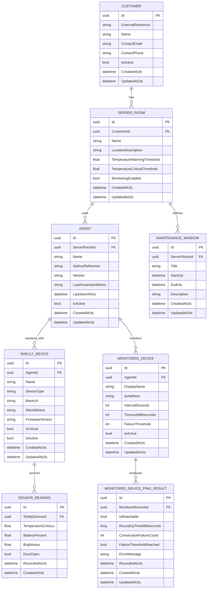

# Technical Documentation

## Project Status

This document describes the current backend target architecture for the Server Room Monitoring project.

As of Saturday, July 18, 2026, the project contains:

- `SRMCore` as the main backend API
- `SRMAuth` as the authentication and user-management API
- `SRMApp` as the Blazor frontend
- `SRMAgent` as the customer-side monitoring agent

Ticket system integration is still intentionally deferred to a later phase.

## Backend Scope

The Core API is responsible for:

- managing customers
- managing server rooms and deployed agents
- managing Shelly device registration data
- managing monitored devices configured per agent
- storing monitored-device ping result history reported by agents
- managing maintenance windows
- storing sensor readings reported from Shelly devices

The Core API exposes RESTful CRUD endpoints for each current domain entity and is documented through OpenAPI and Scalar.

The shared domain entities are implemented in `SRMShared` and reused by the backend services.
DTOs are implemented in `SRMShared/DTOs` with one folder per entity and a `BaseDto`, `CreateDto`, `UpdateDto`, and `ReadDto` structure.

`SRMCore` exposes CRUD controllers for all current domain entities using Entity Framework Core with SQL Server persistence.

The internal backend flow is structured as follows:

- controllers expose the REST API
- controllers expose DTO-based request and response contracts
- controllers share common CRUD flow through a DTO-aware generic `CrudControllerBase`
- DTO conversion is delegated to typed mapper services implementing `ICrudDtoMapper<TEntity, TCreateDto, TUpdateDto, TReadDto>`
- service classes contain the application-facing CRUD logic
- Entity Framework Core handles database access through `SrmCoreDbContext`

## Validation

DTO validation is defined on the DTO contracts through data annotations and small custom validation attributes.

The current validation scope includes:

- required fields
- email format
- IP address format
- URL format
- MAC address format
- numeric ranges
- non-empty GUID checks
- cross-field checks for server room temperature thresholds
- cross-field checks for maintenance window start and end times

For authentication-related password operations, the backend enforces a shared password policy in application logic:

- minimum length: 12 characters
- at least one uppercase letter
- at least one lowercase letter
- at least one digit
- at least one special character

The `SRMAuth` API returns explicit `400 Bad Request` responses for password-policy violations and invalid password-change attempts such as an incorrect current password or reusing the current password as the new password.

## Authentication and Authorization

The current authentication implementation includes:

- `SRMAuth` issues JWT bearer tokens for human users and agents
- `SRMAuth` issues refresh tokens for human users
- `SRMCore` validates JWT bearer tokens issued by `SRMAuth`
- `SRMApp` performs login against `SRMAuth` and forwards bearer tokens to `SRMCore`
- `SRMAgent` performs machine login against `SRMAuth` and calls dedicated agent endpoints in `SRMCore`
- machine principals are represented by `AgentCredential` records instead of human user accounts
- `AgentCredential.AgentId` is stored in `SRMAuth` as an external reference to the corresponding agent in `SRMCore`, without a database-level foreign key across service boundaries
- access-token revocation is enforced in both `SRMAuth` and `SRMCore` through persisted revoked token JTIs

The current dedicated agent reporting path is:

- `POST /api/auth/agent/login` in `SRMAuth`
- `GET /api/agent-runtime/configuration` in `SRMCore`
- `POST /api/agent-reporting/sensor-readings` in `SRMCore`
- `POST /api/agent-reporting/ping-results` in `SRMCore`

The runtime configuration endpoint returns the authenticated agent together with its active Shelly devices and monitored devices.
The reporting service accepts only Shelly devices and monitored devices that belong to the authenticated agent claim.

The current human-authentication flow also includes:

- `POST /api/auth/refresh` in `SRMAuth`
- `POST /api/auth/logout` in `SRMAuth`

Refresh tokens are currently persisted in the auth SQL database.
On logout, the active refresh token is revoked and the current JWT access token JTI is stored as revoked so it cannot be reused until expiry.

This current implementation is operational, but it is still a transitional implementation.
The required target architecture from the project specification is:

- SQL Server for durable auth identity data
- Redis for auth token state

That means refresh tokens and access-token revocation state still need to be moved from SQL Server to Redis.

## Frontend Scope

`SRMApp` is a Blazor web application that provides the current management UI over the Core API.

The current frontend structure includes:

- a home page
- a dashboard page
- a login page
- a role-aware user management page with create, list, and edit capabilities
- a dedicated agent credential management page for machine credentials
- a self-service profile page for human users
- a customer management page
- a server room management page
- a server room detail page for hierarchical navigation
- dedicated pages for agents, Shelly devices, monitored devices, monitored-device ping results, maintenance windows, and sensor readings
- a help page
- a contact page
- a client-side language switch between English and German

The current navigation model is hierarchical:

- customers are the entry point
- server rooms can be managed from the customer context
- agents can be managed from the server room context
- Shelly devices and monitored devices can be managed from the agent context
- monitored-device ping results can be managed from the monitored device context
- maintenance windows remain managed from the server room context
- sensor readings can be managed from the Shelly device context

`SRMApp` accesses backend data through typed HTTP clients and DTO contracts from `SRMShared`.
It does not access `SRMCore` controllers or services directly in-process.

The current frontend authentication uses a scoped server-side auth session inside the Blazor Server application and forwards bearer tokens to `SRMAuth` and `SRMCore`.
The UI supports:

- direct login against `SRMAuth`
- self-service profile update and password change
- user creation, listing, editing, deactivation, and administrative password reset for authorized user managers
- agent credential creation, listing, editing, and secret rotation for authorized administrators and employees

After an administrative password reset, the affected user is forced to change the password on the next login before normal navigation is available again.

## Agent Scope

`SRMAgent` contains the current authenticated monitoring flow for backend communication.

The implementation includes:

- typed HTTP clients for `SRMAuth` and `SRMCore`
- agent login through `POST /api/auth/agent/login`
- runtime configuration loading through `GET /api/agent-runtime/configuration`
- a monitoring orchestrator that exchanges agent credentials for a bearer token
- polling of configured virtual Shelly devices through the configured Shelly status endpoint
- sensor reading submission to `SRMCore`
- ICMP ping execution for configured monitored devices
- ping result submission to `SRMCore`
- exponential retry/backoff for transient auth, Core API, and Shelly communication failures
- local tracking of consecutive ping failures with failure-threshold evaluation per monitored device
- a hosted background worker that runs the monitoring cycle repeatedly
- a local trigger endpoint in `SRMAgent` for manually running a monitoring cycle
- a local Shelly webhook endpoint for immediate status ingestion

The current agent implementation does not yet perform:

- advanced alert generation or ticket creation based on the persisted failure state
- richer webhook hardening if the final Shelly delivery model requires it

## Test Status

`SRMUnitTests` currently contains NUnit-based unit tests for:

- `CustomerService`
- `ServerRoomService`
- `AgentService`
- `ShellyDeviceService`
- `MonitoredDeviceService`
- `MonitoredDevicePingResultService`
- `MaintenanceWindowService`
- `SensorReadingService`
- `AgentReportingService`
- `AgentRuntimeService`
- `CustomersController`
- `ServerRoomsController`
- `AgentsController`
- `ShellyDevicesController`
- `MonitoredDevicesController`
- `MonitoredDevicePingResultsController`
- `MaintenanceWindowsController`
- `SensorReadingsController`
- `AgentReportingController`
- `AgentRuntimeController`

The service tests use the Entity Framework Core in-memory provider to verify CRUD behavior and audit timestamp handling.
DTO validation rules are verified through dedicated unit tests in `SRMUnitTests`.
`SRMUnitTests` also contain auth-focused unit coverage for password-policy validation, password-change failure behavior, and user-management authorization scope in `SRMAuth`.
`SRMUnitTests` also verify that authenticated agents:

- may submit sensor readings only for Shelly devices that belong to their own agent identity
- may retrieve only their own runtime configuration from `SRMCore`
- may submit persisted ping-result reports only for their own monitored devices

`SRMIntegrationTests` is a separate NUnit project for real SQL Server-backed integration tests.
These tests require the Docker SQL Server container to be running and use dedicated integration test databases for `SRMCore` and `SRMAuth`.

The frontend has been verified at build level through `dotnet build SRMApp\SRMApp.csproj`.

## Persistence Strategy

- primary relational database: Microsoft SQL Server
- SQL Server runs in a Docker container
- `SRMCore` uses SQL Server through Entity Framework Core
- `SRMAuth` currently also uses SQL Server for identity data, refresh tokens, and token revocation data
- Redis is part of the required target architecture for `SRMAuth`, but it is not yet used by the current implementation
- the current implementation initializes the schema through `Database.EnsureCreated()`
- database schema changes require the SQL Server Docker data volume or database to be recreated unless the project is later switched to EF Core migrations
- no secrets must be stored directly in source code
- the initial auth seed users are read from the `AuthSeedData` section in the `SRMAuth` JSON configuration files
- API endpoint base URLs for `SRMApp` and `SRMAgent` are read directly from their JSON configuration files

## Initial Data Model

### ER Diagram

## Table Descriptions

### `Customer`

Represents a customer account in the system. A customer can own one or more server rooms and contains the business contact information needed for administration.

### `ServerRoom`

Represents one monitored server room at a customer site. This table is the central aggregate for room-specific monitoring configuration and monitoring data.

### `Agent`

Represents the on-site appliance or virtual agent responsible for ping checks and communication with the Core API. It stores operational metadata such as version, last known IP address, and last contact time.

The agent is the local gateway inside the customer network. It communicates with the Shelly device, executes ICMP checks against configured network devices, and sends the collected data to the Core API over outbound HTTPS.

The agent is the technical parent for both Shelly devices and other monitored devices. The server room remains the business context through the agent's assignment to the room.

### `ShellyDevice`

Represents the Shelly sensor device assigned to an agent. It stores connection and identification data needed to integrate with either a physical or virtual Shelly device.

### `MonitoredDevice`

Represents one network endpoint that the agent must monitor by ICMP ping. It includes the configuration required to control the monitoring interval, timeout, and failure threshold.

### `MonitoredDevicePingResult`

Represents one persisted ICMP check result reported by the agent for a configured monitored device.

It stores reachability, response time, consecutive failure count, and whether the configured failure threshold has been reached at the time of reporting.

### `MaintenanceWindow`

Represents an approved maintenance period for a server room. It is used to distinguish expected operational changes, such as an opened door during planned work, from alert-worthy incidents.

### `SensorReading`

Represents a measured monitoring snapshot reported by the agent and originating from the Shelly device. It stores temperature and optional telemetry fields together with the reported door state at the time of capture.

This table intentionally keeps the door state together with the other Shelly data in one record. That matches the current payload structure and keeps future ticket integration simple because incidents can later be derived from sensor readings and maintenance windows without introducing a separate door event table.

`SensorReading` only references `ShellyDevice`. The related `Agent` and `ServerRoom` can be derived through `ShellyDevice -> Agent -> ServerRoom`, which avoids redundant foreign keys and inconsistency risk.

## Notes and Open Design Decisions

- The authentication and authorization design is documented in `AUTHENTICATION_AUTHORIZATION_CONCEPT.md`.
- Agents are authenticated through `AgentCredential` machine credentials instead of `AuthUser` human accounts.
- The implemented auth persistence currently differs from the target architecture because token state is still stored in SQL Server instead of Redis.
- Ticket integration is specified in `TICKET_INTEGRATION_SPECIFICATION.md` but is not implemented yet.
- Incident persistence is not yet modeled because the first ticket-integration slice has not been implemented yet.
- The current model treats `ServerRoom` as the aggregate root for `Agent` and `MaintenanceWindow`.
- The current model treats `Agent` as the technical parent for `ShellyDevice` and `MonitoredDevice`.
- The current frontend pages provide CRUD-oriented management structure, but deeper UX polish, richer validation feedback, and production-grade navigation behavior still need further iteration.
