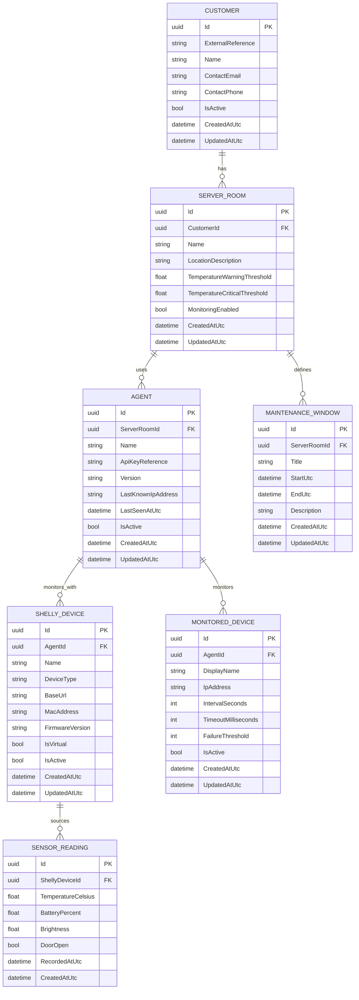

# Technical Documentation

## Project Status

This document describes the current backend target architecture for the Server Room Monitoring project.

The current implementation phase focuses on the backend only. The first deliverable is the database design for the Core API. Authentication and ticket system integration are intentionally deferred to a later phase.

## Backend Scope

The Core API is responsible for:

- Managing customers.
- Managing server rooms and deployed agents.
- Managing Shelly device registration data.
- Managing monitored devices configured per agent.
- Managing maintenance windows.
- Storing sensor readings reported from Shelly devices.

The Core API will expose RESTful CRUD endpoints for each domain entity and will be documented through OpenAPI and Scalar.

The shared domain entities are implemented in `SRMShared` and are intended to be reused by the backend services.
DTOs are implemented in `SRMShared/DTOs` with one folder per entity and a `BaseDto`, `CreateDto`, `UpdateDto`, and `ReadDto` structure.

At the current stage, `SRMCore` exposes CRUD controllers for all domain entities using Entity Framework Core with SQL Server persistence.

The internal backend flow is structured as follows:

- Controllers expose the REST API.
- Controllers expose DTO-based request and response contracts.
- Controllers share common CRUD flow through a DTO-aware generic `CrudControllerBase`.
- DTO conversion is delegated to typed mapper services implementing `ICrudDtoMapper<TEntity, TCreateDto, TUpdateDto, TReadDto>`.
- Service classes contain the application-facing CRUD logic.
- Entity Framework Core handles database access through `SrmCoreDbContext`.

DTO validation is defined on the DTO contracts through data annotations and small custom validation attributes. The current validation scope includes:

- required fields
- email format
- IP address format
- URL format
- MAC address format
- numeric ranges
- non-empty GUID checks
- cross-field checks for server room temperature thresholds
- cross-field checks for maintenance window start and end times

## Test Status

`SRMUnitTests` currently contains NUnit-based unit tests for:

- `CustomerService`
- `ServerRoomService`
- `AgentService`
- `ShellyDeviceService`
- `MonitoredDeviceService`
- `MaintenanceWindowService`
- `SensorReadingService`
- `CustomersController`
- `ServerRoomsController`
- `AgentsController`
- `ShellyDevicesController`
- `MonitoredDevicesController`
- `MaintenanceWindowsController`
- `SensorReadingsController`

The service tests use the Entity Framework Core in-memory provider to verify CRUD behavior and audit timestamp handling.
DTO validation rules are verified through dedicated unit tests in `SRMUnitTests`.

`SRMIntegrationTests` is a separate NUnit project for real SQL Server-backed integration tests. These tests require the Docker SQL Server container to be running and use a dedicated integration test database.

## Persistence Strategy

- Primary relational database: Microsoft SQL Server.
- SQL Server must run in a Docker container.
- Database schema changes will require the database container or database instance to be recreated or migrated, depending on the chosen implementation approach.
- No secrets must be stored directly in source code.
- The current implementation uses Entity Framework Core and initializes the schema through `Database.EnsureCreated()`.

## Initial Data Model

### ER Diagram

## Table Descriptions

### `Customer`

Represents a customer account in the system. A customer can own one or more server rooms and contains the business contact information needed for administration.

### `ServerRoom`

Represents one monitored server room at a customer site. This table is the central aggregate for room-specific monitoring configuration and monitoring data.

### `Agent`

Represents the on-site appliance or virtual agent responsible for ping checks and communication with the Core API. It stores operational metadata such as version, last known IP address, and last contact time.

The agent is the local gateway inside the customer network. It communicates with the Shelly device, executes ICMP checks against configured network devices, and sends the collected data to the Core API over outbound HTTPS.

The agent is the technical parent for both Shelly devices and other monitored devices. The server room remains the business context through the agent's assignment to the room.

### `ShellyDevice`

Represents the Shelly sensor device assigned to a server room. It stores connection and identification data needed to integrate with either a physical or virtual Shelly device.

The Shelly device is linked directly to the agent. This reflects that the agent is the component that actively communicates with the Shelly and forwards the collected data to the Core API.

### `MonitoredDevice`

Represents one network endpoint that the agent must monitor by ICMP ping. It includes the configuration required to control the monitoring interval, timeout, and failure threshold.

### `MaintenanceWindow`

Represents an approved maintenance period for a server room. It is used to distinguish expected operational changes, such as an opened door during planned work, from alert-worthy incidents.

### `SensorReading`

Represents a measured monitoring snapshot reported by the agent and originating from the Shelly device. It stores temperature and optional telemetry fields together with the reported door state at the time of capture.

This table intentionally keeps the door state together with the other Shelly data in one record. That matches the current payload structure and keeps future ticket integration simple because incidents can later be derived from sensor readings and maintenance windows without introducing a separate door event table.

`SensorReading` only references `ShellyDevice`. The related `Agent` and `ServerRoom` can be derived through `ShellyDevice -> Agent -> ServerRoom`, which avoids redundant foreign keys and inconsistency risk.

## Notes and Open Design Decisions

- Authentication is not yet modeled in the relational database because it is currently out of scope.
- Ticket integration is not yet modeled because the target on-premise system is not yet selected.
- Ping result history is not yet included as a dedicated table. It can be added later if historical network availability reporting is required.
- The current model treats `ServerRoom` as the aggregate root for `Agent` and `MaintenanceWindow`.
- The current model treats `Agent` as the technical parent for `ShellyDevice` and `MonitoredDevice`.
- Database changes will need coordinated updates to the SQL Server Docker setup once the actual persistence layer is implemented.
- Because the current startup path uses `EnsureCreated`, schema changes require the SQL Server Docker data volume to be recreated unless the project is later switched to EF Core migrations.
