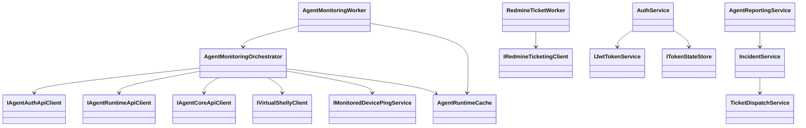
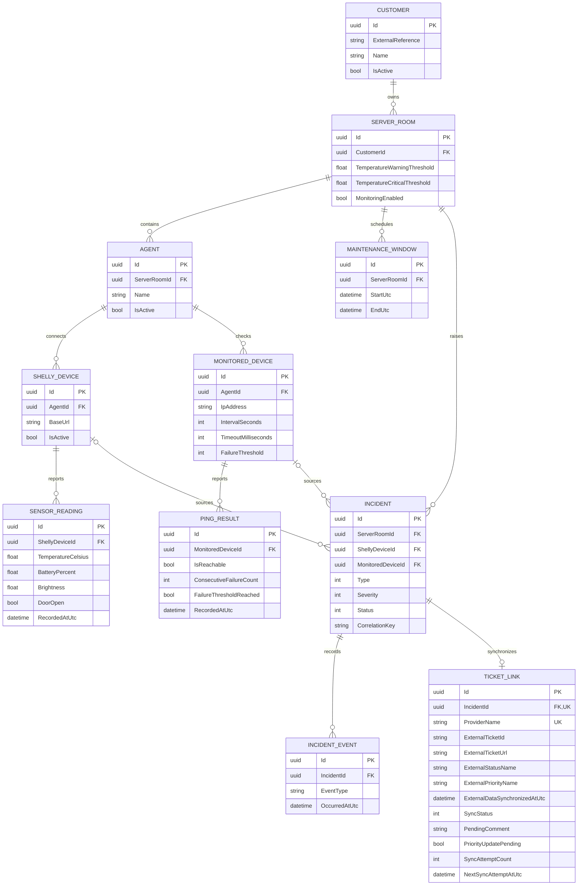

# Technical Documentation

## Scope

SRM is a .NET 10 microservice solution for monitoring server rooms. It separates on-site collection, central business logic, authentication, presentation, and ticketing.

| Project | Responsibility |
|---|---|
| `SRMAgent` | Poll Shelly devices, receive immediate Shelly webhooks, run per-device ICMP checks, submit telemetry |
| `SRMCore` | Own business data, authorization scope, incident rules, and Redmine dispatch |
| `SRMAuth` | Own users, roles, Agent credentials, JWT issuance, refresh, and revocation |
| `SRMApp` | Blazor Server UI for monitoring and administration |
| `SRMShared` | Shared entities, DTOs, validation attributes, roles, and token-store contract |
| `SRMUnitTests` | Fast service/controller/validation tests |
| `SRMIntegrationTests` | SQL Server integration tests using dedicated databases |
| `SRMDemoSeeder` | Optional repeatable demo records for a full deployment |

## Runtime communication

The customer appliance is expected to sit behind a firewall. It initiates HTTPS calls to Auth and Core; Core never calls the Agent. Inside the local Docker environment, service-to-service HTTP stays on Docker networks. Azure exposes App and Redmine through HTTPS ingress while Auth and Core use internal ingress.

Agent monitoring behavior:

1. Authenticate with an `AgentCredential`.
2. Refresh runtime configuration every 30 seconds. Ping-relevant target changes reset that target's cached schedule and consecutive-failure count.
3. Poll active Shelly devices on the global monitoring cycle.
4. Accept a Shelly webhook for immediate door-state ingestion.
5. Ping each active monitored target only when its own `IntervalSeconds` is due.
6. Track consecutive failures and submit results to Core.
7. Core persists each report before incident evaluation and ticket queuing.

If `ServerRoom.MonitoringEnabled` is false, Core returns no active Shelly or ping targets for that room.

## Class diagram

## Core data model

All Core entities inherit `BaseEntity` and receive UTC creation/update timestamps in `SrmCoreDbContext`. DTO annotations enforce required values, lengths, ranges, non-empty IDs, IP/host formats, temperature threshold ordering, and maintenance-window ordering.

## API and authorization

- Human read endpoints: `SystemAdmin`, `Employee`, `CustomerAdmin`, `Customer`.
- Generic mutation endpoints: `SystemAdmin`, `Employee` only.
- Customer reads are filtered through the object chain back to `CustomerId`.
- Customer administration endpoints themselves are internal-only.
- `GET /api/agent-runtime/configuration`: Agent-only and scoped to the token's `agent_id`.
- `POST /api/agent-reporting/sensor-readings`: Agent-only and validates Shelly assignment.
- `POST /api/agent-reporting/ping-results`: Agent-only and validates monitored-device assignment.
- Incident endpoints are read-only and customer-filtered.

Detailed identity rules are in [AUTHENTICATION_AUTHORIZATION_CONCEPT.md](AUTHENTICATION_AUTHORIZATION_CONCEPT.md).

## Incident rules

Core evaluates persisted reports for:

- door open outside a maintenance window (`Critical`)
- warning temperature threshold (`Warning`)
- critical temperature threshold (`Critical`)
- monitored-device failure threshold (`Major`)

Correlation keys suppress duplicate incidents while a physical condition remains active. Clearing a condition resolves the incident and queues a Redmine comment. A door reopening creates a new incident and ticket. A recurring temperature condition reuses its existing ticket while that Redmine ticket remains nonterminal; warning/critical transitions update its priority. Ticket details and retry behavior are defined in [TICKET_INTEGRATION_SPECIFICATION.md](TICKET_INTEGRATION_SPECIFICATION.md).

## Persistence and deployment

- Core and Auth use separate SQL Server databases.
- Redis stores refresh-token state and revoked access-token JTIs.
- Redmine uses PostgreSQL.
- `Database.EnsureCreated()` currently creates SQL schemas; there are no migrations.
- Docker Compose separates data, service, ticket, and customer-site traffic into `srm-data`, `srm-services`, `srm-ticket`, and `srm-site` networks. App joins the data network because its server-side Data Protection key ring is stored in Redis; it is not exposed to the customer-site network.
- Runtime secrets are generated from ignored environment files into service-specific environment files.
- Tracked `appsettings*.json` files contain no deployable credentials.

Any entity-model change requires new test databases and currently requires recreation of existing local application databases. Do not delete volumes unless data loss is intentional.

## Verification

Unit tests cover CRUD, ownership, DTO validation, Auth behavior, Agent reporting/runtime configuration, incident creation/resolution, ticket idempotency, and per-device ping scheduling. Integration tests exercise Core/Auth services against SQL Server.

Known production and coverage gaps are maintained only in [TODO.md](TODO.md).
