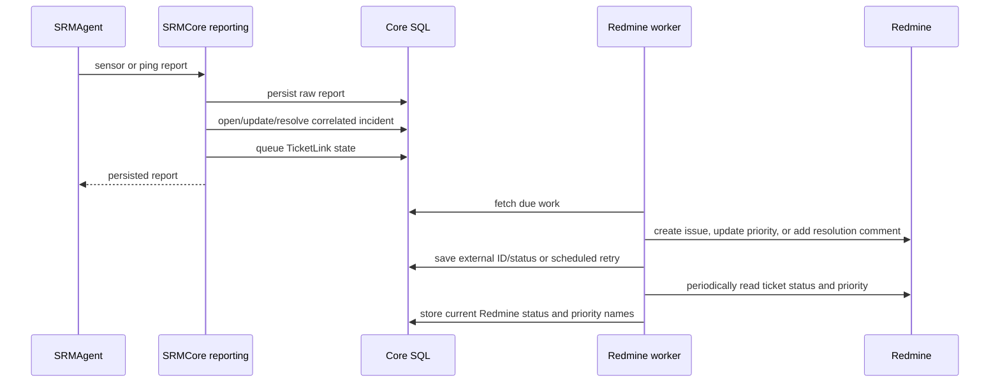

# Ticket Integration Specification

## Status and scope

The first Redmine integration slice is implemented in `SRMCore`. The Agent reports facts only; it never creates tickets. Core persists telemetry, evaluates incidents, stores ticket work, and processes that work asynchronously.

The selected ticket system is the on-premise Redmine container. Tickets remain editable only in Redmine; SRMApp displays incident and synchronization information read-only.

## Event rules

| Event | Trigger | Severity | Redmine priority |
|---|---|---|---|
| Door open outside maintenance | `DoorOpen=true` and no room maintenance window at reading time | Critical | configured critical priority |
| Temperature warning | value >= warning and < critical threshold | Warning | configured warning priority |
| Temperature critical | value >= critical threshold | Critical | configured critical priority |
| Monitored device failure | reported consecutive-failure threshold reached | Major | configured major priority |

Battery, brightness, Shelly-offline, and Agent-offline events are optional/deferred.

## Processing flow

Monitoring persistence does not wait for Redmine. A Redmine outage therefore does not reject the Agent report.

## Correlation and idempotency

Correlation keys are built from incident type, room, and relevant source device. Rules:

- reuse an active incident with the same correlation key
- keep at most one `TicketLink` per incident/provider
- never return a created ticket to `PendingCreate` for a repeated observation
- append incident events for repeated triggers
- correlate temperature by server room rather than by warning/critical severity
- update the same Redmine priority when temperature changes between warning and critical
- for temperature, reuse the ticket after the physical condition clears while its Redmine workflow status remains nonterminal
- for temperature, create a new incident and ticket only after the previous Redmine ticket is `Resolved`, `Rejected`, or `Closed`
- for a door, closing resolves the current incident and queues a comment; reopening always creates a new incident and ticket

The database has a unique `(IncidentId, ProviderName)` index as the final ticket-link duplication guard.

## Incident lifecycle

`IncidentStatus` maps all Redmine workflow states: `New`, `InProgress`, `Resolved`, `Feedback`, `Closed`, and `Rejected`. `InProgress` is displayed as `In Progress`. The periodic Redmine refresh updates this typed SRM status.

- Door closure resolves an open door incident.
- A later door reopening creates a new incident and ticket even if the earlier Redmine ticket remains nonterminal.
- Reachability resolves an open connectivity incident.
- Normal temperature resolves warning/critical temperature incidents.
- Moving between warning and critical updates the existing incident and Redmine priority without creating another ticket.
- Resolution adds a comment to Redmine; SRM does not automatically close the external issue.
- Incidents whose Redmine ticket is `Resolved`, `Rejected`, or `Closed` are omitted from SRM incident queries and dashboards.

## Statuses shown in SRMApp

The incident overview keeps the workflow and technical synchronization concepts separate:

- **Ticket sync status** describes only initial Redmine creation. Both the enum and UI contain exactly `Pending Create`, `Created`, and `Error`. Pending comments and priority updates are stored in separate queue fields and never replace a successful `Created` result.
- **Ticket status** is read from Redmine and uses its workflow names: `New`, `In Progress`, `Resolved`, `Feedback`, `Closed`, or `Rejected`.

SRM retains its typed `IncidentStatus` mirror internally for business logic, but the UI shows only the Redmine ticket status to avoid duplicate workflow information.

Core periodically refreshes the external ticket status and priority. A temporary refresh failure retains the last successfully read values and does not change the initial ticket-creation result.

## Ticket payload

Every created Redmine issue contains:

- SRM incident description
- source system (`SRMCore`)
- customer name
- server-room name
- incident type and severity
- UTC event timestamp
- correlation key
- internal incident ID
- relevant Shelly name or monitored-device name/IP address

The Redmine project, tracker, initial status, poll interval, and priority IDs are configuration values. With the standard local Redmine data, SRM maps warning incidents to `High`, major incidents to `Urgent`, and critical incidents to `Immediate`. The incident overview displays the actual priority name returned by Redmine after ticket creation. API credentials come from deployment configuration and are never stored in source.

## Retry behavior

The worker records the last error, attempt count, last attempt time, and next attempt time. Failed create, comment, and priority-update operations are retried with exponential delays starting at five seconds and capped at fifteen minutes. A successful synchronization clears retry metadata.

The worker processes at most twenty due links per cycle. Failures are logged without API-key disclosure.

## Security and exposure

- Redmine credentials are provided through service-specific environment configuration.
- Azure exposes Redmine through external HTTPS ingress.
- Local development may publish Redmine over HTTP on a developer-selected host port.
- Agent and frontend endpoints cannot directly request ticket creation.
- Customers can view only ticket links attached to incidents belonging to their customer.

## Remaining work

Automated Redmine worker/adapter integration tests, dependency-aware health reporting, and operational administration for permanently failing work remain open in [TODO.md](TODO.md).
